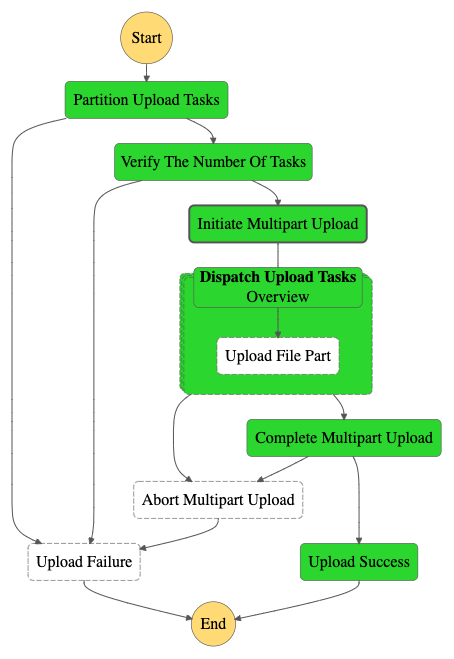

# File Uploader

[](https://github.com/CameronXie/file-uploader/actions/workflows/test.yml)

This project demonstrates an approach to leverage S3 multipart upload and Step Functions (Distributed Map) to
concurrently download a large file, up to 100TB (10GB * 10,000) in theory, from any given url (request range is
required), and upload to a S3 bucket.

## Solution

### Components

* `Partitioner` An Python Lambda take `URL` and `SingleTaskSize` as input, fetches the total download file size from
  given url. Based on given single task size, split the upload task into smaller tasks, and pass tasks to
  next state.
* `Uploader` An Python Lambda is triggered by Step Functions leverages `request range` to download a portion of file,
  and upload to S3 by using multipart upload.
* `Step Functions` An state machine handles tasks validation, fan-out, retry and error handling, also handles S3
  multipart upload create, complete and abort.

### Diagram



## Test

Simply run `make test` to run lint and unit test on `Partitioner` and `Uploader`.

## Deploy

### Prerequisites

* An AWS IAM user account which has enough permission to deploy:
    * Step Functions
    * Lambda
    * S3
* Set up `AWS_ACCESS_KEY_ID`, `AWS_SECRET_ACCESS_KEY`, `AWS_DEFAULT_REGION` and `CDK_DEFAULT_ACCOUNT` in `.env` file.

### Deploy with Docker

Simply run `make ci-deploy` to run lint, build, and deploy the solution.

## Example

An example Step Functions payload below to upload an awscli file to S3.

```json
{
  "URL": "https://awscli.amazonaws.com/awscli-exe-linux-x86_64.zip",
  "SingleTaskSize": 6000000
}
```

